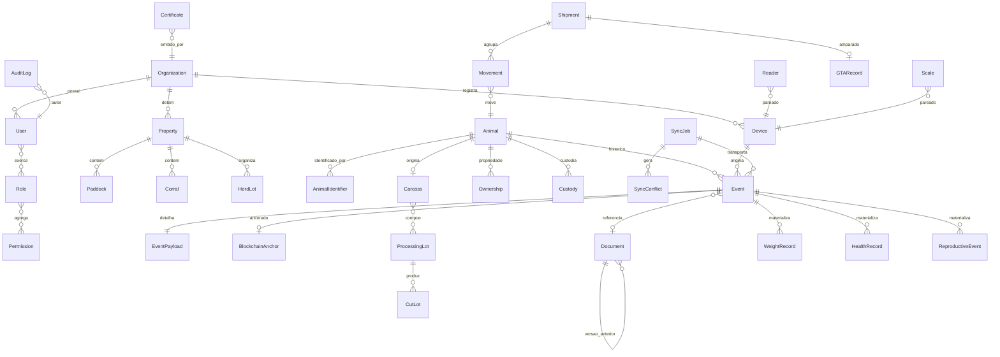
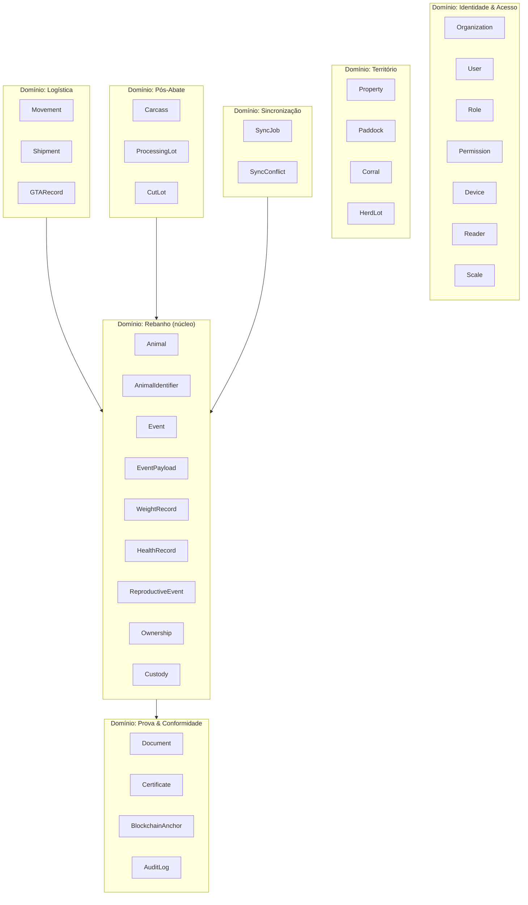

# Documento 4 — Modelo de Domínio

## 1. Convenções do dicionário de dados

| Convenção | Valor |
|-----------|-------|
| Chave primária | `id UUID` (UUIDv7 para entidades criadas em fluxo de eventos — ordenável no tempo) |
| Timestamps | `createdAt`, `updatedAt` em UTC (`timestamptz`); campos de domínio distinguem `occurredAt` × `recordedAt` |
| Soft delete | Inexistente para eventos e históricos; entidades cadastrais usam `status` (`ACTIVE/SUSPENDED/ARCHIVED`) |
| Classificação de privacidade | `P0` público · `P1` interno · `P2` restrito à org · `P3` dado pessoal/sensível (LGPD) |
| Alteração | `IMUTÁVEL` (nunca), `VERSIONADA` (nova versão preserva anterior), `CADASTRAL` (editável com AuditLog) |
| Correção | Eventos: novo evento com `correctionOf`. Cadastros: edição auditada. Históricos: nunca |
| Retenção | Eventos e âncoras: permanente. Documentos: por classe (Doc 13). Logs técnicos: 13 meses |

## 2. Diagrama de entidades (visão macro)

## 3. Agregados e limites de domínio

**Raízes de agregado**: `Organization`, `Property`, `Animal`, `Shipment`, `Document`,
`SyncJob`, `Carcass`, `ProcessingLot`. Referências entre agregados sempre por ID,
nunca por navegação transacional. `Event` pertence ao agregado `Animal` (ou a
`Shipment`/`CutLot` quando o sujeito não é um animal individual).

**DECISÃO** — `Event` é a fonte de verdade do domínio Rebanho. `WeightRecord`,
`HealthRecord` e `ReproductiveEvent` são **projeções materializadas** (read models)
reconstituíveis a partir dos eventos; podem ser regeradas do zero.

## 4. Dicionário de dados — entidades núcleo

### 4.1 Animal

Finalidade: identidade digital permanente do bovino. Origem: `REGISTER_ANIMAL`.
Alteração: derivada de eventos (nenhum campo de estado é editável diretamente).
Correção: `CORRECT_REGISTRATION`. Retenção: permanente. Privacidade: P2.

| Campo | Tipo | Obrig. | Validação / Regra | Índice/Unicidade |
|-------|------|:-:|-------------------|------------------|
| id (animalId) | UUIDv7 | ✔ | Imutável (R1) | PK |
| officialAnimalId | varchar(20) | ✖ | Formato SISBOV (15 dígitos, prefixo 076) quando presente | UNIQUE parcial (onde não nulo, por contexto oficial) |
| speciesCode | enum | ✔ | `BOVINE`, `BUBALINE` | — |
| breedCode | varchar(10) | ✖ | Catálogo de raças | idx |
| sex | enum | ✔ | `M`, `F` | — |
| birthDate | date | condicional | ≤ hoje; obrigatória se nascido na plataforma | idx |
| birthType | enum | ✔ | `BORN_ON_PROPERTY`, `PURCHASED`, `IMPORTED_RECORD` | — |
| damId | UUID | ✖ | FK Animal; via `OFFSPRING_LINK` | idx |
| sireRef | varchar(60) | ✖ | Touro/sêmen (pode ser externo) | — |
| lifecycleStatus | enum (derivado) | ✔ | `ACTIVE`, `IN_TRANSIT`, `QUARANTINED`, `SLAUGHTERED`, `DEAD`, `CLOSED` — projeção, nunca editada (R13) | idx |
| currentPropertyId | UUID (derivado) | ✖ | Projeção de PROPERTY_ENTRY/EXIT | idx |
| currentHerdLotId | UUID (derivado) | ✖ | Projeção de LOT_CHANGE | idx |
| createdAt / updatedAt | timestamptz | ✔ | — | — |

### 4.2 AnimalIdentifier

Finalidade: histórico de identificadores físicos/oficiais do animal. Origem:
`LINK_IDENTIFIER`, `REIDENTIFICATION`. Alteração: IMUTÁVEL (inativação lógica via
novo evento). Retenção: permanente. Privacidade: P2.

| Campo | Tipo | Obrig. | Validação | Índice/Unicidade |
|-------|------|:-:|-----------|------------------|
| id | UUIDv7 | ✔ | — | PK |
| animalId | UUID | ✔ | FK Animal | idx composto |
| identifierType | enum | ✔ | `RFID`, `VISUAL`, `OFFICIAL`, `BIRTHMARK`, `OTHER` | — |
| rfidCode | varchar(24) | condicional | ISO 11784: 15 dígitos; obrigatório se type=RFID | **UNIQUE parcial: onde `active=true` e type=RFID** (R3) |
| visualTagNumber | varchar(30) | condicional | Obrigatório se type=VISUAL | idx |
| officialNumber | varchar(20) | condicional | Se type=OFFICIAL | UNIQUE parcial ativo |
| active | boolean | ✔ | 1 ativo por (animalId, identifierType) — UNIQUE parcial (R4) | idx |
| linkedAt / unlinkedAt | timestamptz | ✔/✖ | unlinkedAt em REIDENTIFICATION | — |
| unlinkReason | enum | ✖ | `LOST`, `DAMAGED`, `RECALL`, `UPGRADE`, `ERROR` | — |
| linkEventId / unlinkEventId | UUID | ✔/✖ | FK Event — rastreio da origem | — |

### 4.3 Event (envelope)

Finalidade: registro imutável de todo fato do domínio. Origem: app, API, serviços.
Alteração: IMUTÁVEL (R7). Correção: novo evento com `correctionOf` (R8).
Retenção: permanente. Privacidade: envelope P2; payload conforme tipo.

| Campo | Tipo | Obrig. | Validação | Índice/Unicidade |
|-------|------|:-:|-----------|------------------|
| id (eventId) | UUIDv7 | ✔ | Gerado no dispositivo de origem | PK |
| schemaVersion | varchar(8) | ✔ | Semver do schema do payload | — |
| eventType | enum | ✔ | Catálogo do Documento 5 | idx composto (animalId, eventType, occurredAt) |
| subjectType | enum | ✔ | `ANIMAL`, `SHIPMENT`, `CARCASS`, `CUT_LOT`, `DOCUMENT`, `HERD_LOT` | — |
| animalId | UUID | condicional | FK; obrigatório se subjectType=ANIMAL | idx |
| subjectId | UUID | ✔ | ID do sujeito conforme subjectType | idx |
| occurredAt | timestamptz | ✔ | ≤ recordedAt + tolerância de relógio (Doc 8 §9) | idx |
| recordedAt | timestamptz | ✔ | Momento do registro no dispositivo (R24) | — |
| receivedAt | timestamptz | ✔ | Momento do aceite na API | — |
| organizationId | UUID | ✔ | FK; org do ator no momento (R28) | idx |
| actorId | UUID | ✔ | FK User | idx |
| deviceId | UUID | ✔ | FK Device registrado (R25) | idx |
| deviceSequence | bigint | ✔ | Monotônico por dispositivo (R22, R27) | UNIQUE (deviceId, deviceSequence) |
| appVersion | varchar(20) | ✔ | R25 | — |
| propertyId | UUID | ✖ | FK Property | idx |
| payloadRef | UUID | ✔ | FK EventPayload | — |
| payloadHash | char(64) | ✔ | SHA-256 do payload canônico (Doc 11 §4) | idx |
| signature | text | ✔ | Assinatura do dispositivo sobre o hash (R26) | — |
| sourceSystem | enum | ✔ | `MOBILE_OFFLINE`, `MOBILE_ONLINE`, `WEB`, `API_INTEGRATION`, `SYSTEM` | — |
| correctionOf | UUID | ✖ | FK Event; encadeia correções (R8) | idx |
| syncStatus | enum | ✔ | Estados do Documento 8 §5 | idx |
| blockchainTxId | varchar(128) | ✖ | Preenchido após CONFIRMED_ON_BLOCKCHAIN | idx |

### 4.4 EventPayload

Finalidade: conteúdo completo do evento em JSONB, separado do envelope para
indexação e para clareza da fronteira on-chain/off-chain (só o hash sobe).

| Campo | Tipo | Obrig. | Validação |
|-------|------|:-:|-----------|
| id | UUID | ✔ | PK |
| eventId | UUID | ✔ | FK UNIQUE |
| canonicalJson | jsonb | ✔ | Validado por JSON Schema versionado do eventType |
| schemaVersion | varchar(8) | ✔ | Compatível com Event.schemaVersion |

### 4.5 Document

Finalidade: metadados de documento em storage de objetos. Alteração: VERSIONADA
(R20). Retenção: por classe documental. Privacidade: P2–P3 conforme classe.

| Campo | Tipo | Obrig. | Validação | Índice |
|-------|------|:-:|-----------|--------|
| id | UUIDv7 | ✔ | — | PK |
| documentClass | enum | ✔ | `GTA`, `PRESCRIPTION`, `LAB_REPORT`, `INVOICE`, `CERTIFICATE_DOC`, `PHOTO`, `OTHER` | idx |
| storageKey | varchar(512) | ✔ | Chave no bucket, nunca URL pública | UNIQUE |
| sha256 | char(64) | ✔ | Conferido no upload (ERR-DOC-001) | idx |
| mimeType | varchar(120) | ✔ | Allowlist por classe | — |
| sizeBytes | bigint | ✔ | Limite por classe | — |
| version | int | ✔ | ≥1 | — |
| previousVersionId | UUID | ✖ | FK Document (R20) | idx |
| ownerOrganizationId | UUID | ✔ | Controle de acesso | idx |
| privacyClass | enum | ✔ | P1–P3 | — |
| retentionClass | varchar(30) | ✔ | Política Doc 13 | — |
| uploadedBy / uploadedAt | UUID/timestamptz | ✔ | — | — |

### 4.6 BlockchainAnchor

Finalidade: vínculo evento/documento ↔ transação Fabric. Alteração: IMUTÁVEL
(novas tentativas criam novas linhas com `attempt`). Retenção: permanente. P1.

| Campo | Tipo | Obrig. | Observação |
|-------|------|:-:|------------|
| id | UUIDv7 | ✔ | PK |
| subjectType / subjectId | enum/UUID | ✔ | `EVENT` ou `DOCUMENT` |
| payloadHash | char(64) | ✔ | O que foi ancorado |
| channel | varchar(60) | ✔ | Canal Fabric |
| chaincodeFn | varchar(60) | ✔ | Função invocada |
| txId | varchar(128) | ✖ | Preenchido no sucesso; UNIQUE parcial |
| blockNumber | bigint | ✖ | — |
| status | enum | ✔ | `PENDING`, `SUBMITTED`, `CONFIRMED`, `FAILED` |
| attempt | int | ✔ | Contador de tentativas |
| endorsingOrgs | jsonb | ✖ | MSPs que endossaram |
| submittedAt / confirmedAt | timestamptz | ✖ | — |
| lastError | text | ✖ | — |

### 4.7 SyncJob e SyncConflict

`SyncJob` — lote de sincronização de um dispositivo. P1. Retenção: 24 meses.

| Campo | Tipo | Obrig. | Observação |
|-------|------|:-:|------------|
| id | UUIDv7 | ✔ | PK |
| deviceId / userId | UUID | ✔ | Origem |
| direction | enum | ✔ | `PUSH`, `PULL` |
| eventCount / acceptedCount / rejectedCount / conflictCount | int | ✔ | — |
| status | enum | ✔ | `RECEIVED`, `PROCESSING`, `COMPLETED`, `PARTIAL`, `FAILED` |
| startedAt / finishedAt | timestamptz | ✔/✖ | — |

`SyncConflict` — divergência que exige resolução. P2. Retenção: permanente.

| Campo | Tipo | Obrig. | Observação |
|-------|------|:-:|------------|
| id | UUIDv7 | ✔ | PK |
| syncJobId / eventId | UUID | ✔ | Origem |
| conflictType | enum | ✔ | `DUPLICATE_LOGICAL`, `STALE_STATE`, `IDENTIFIER_TAKEN`, `SUBJECT_CLOSED`, `ORDER_VIOLATION`, `RECEIPT_MISMATCH` |
| resolutionStatus | enum | ✔ | `OPEN`, `AUTO_RESOLVED`, `RESOLVED_KEEP`, `RESOLVED_CORRECT`, `RESOLVED_REJECT` |
| resolvedBy / resolvedAt | UUID/timestamptz | ✖ | Auditado |
| detail | jsonb | ✔ | Estado esperado × recebido |

### 4.8 Movement, Shipment, GTARecord

`Shipment` — agregado logístico. P2. Permanente.

| Campo | Tipo | Obrig. | Observação |
|-------|------|:-:|------------|
| id | UUIDv7 | ✔ | PK |
| originPropertyId / destinationPropertyId | UUID | ✔/✔ | Destino pode ser frigorífico |
| purpose | enum | ✔ | `SALE`, `TRANSFER`, `SLAUGHTER`, `EXHIBITION`, `OTHER` |
| status | enum (derivado) | ✔ | `DRAFT`, `DISPATCHED`, `IN_TRANSIT`, `RECEIVED`, `RECEIVED_WITH_DISCREPANCY`, `CANCELLED` |
| carrierOrgId / vehiclePlate | UUID/varchar | ✖ | Custódia |
| gtaRecordId | UUID | ✖ | FK (R-GTA por UF) |
| dispatchedEventId / receivedEventId | UUID | ✖ | FK Event |

`Movement` — 1 animal dentro de 1 shipment: `id`, `shipmentId`, `animalId` (UNIQUE
composto), `expected boolean`, `dispatchConfirmed`, `receiptConfirmed`,
`discrepancyType (MISSING/UNEXPECTED/IDENTITY_MISMATCH)`.

`GTARecord`: `id`, `gtaNumber+series+uf` (UNIQUE composto), `issueDate`,
`validUntil`, `animalCount`, `documentId` (FK), `reconciliationStatus`
(`UNVERIFIED/MATCHED/DIVERGENT/NOT_APPLICABLE`), `stateSystem` origem. P2.

### 4.9 Ownership e Custody

Ambos históricos append-only por animal. P2–P3 (proprietário é dado pessoal quando
pessoa física). Campos comuns: `id`, `animalId`, `holderOrgId` (ou
`holderPartyRef` off-chain para PF), `startEventId`, `endEventId`, `startAt`,
`endAt`. `Ownership` adiciona `acceptanceEventId` (aceite bilateral, R-CUS-001).
Vigência: no máximo 1 registro aberto (endAt nulo) por animal — UNIQUE parcial.

### 4.10 Pós-abate

`Carcass`: `id`, `animalId` (FK UNIQUE — R33), `slaughterEventId`, `carcassWeightKg`,
`typification` (jsonb: maturidade, acabamento, conformação), `sifNumber`,
`slaughterhouseOrgId`, `createdEventId`. P2.

`ProcessingLot`: `id`, `slaughterhouseOrgId`, `processDate`, `inputWeightKg`;
tabela de junção `processing_lot_carcasses (processingLotId, carcassId)` UNIQUE.

`CutLot`: `id`, `processingLotId`, `cutCode` (catálogo de cortes), `outputWeightKg`,
`packagingDate`, `expiryDate`, `publicCode` (não sequencial, para QR — UNIQUE),
`gs1Gtin` opcional. Balanço de massa: trigger/verificação de serviço
`Σ CutLot.outputWeightKg ≤ ProcessingLot.inputWeightKg × (1 + tolerância)` (R34).

## 5. Dicionário de dados — entidades de suporte (compacto)

| Entidade | Finalidade | Campos-chave | Unicidade/Regra | Priv. | Alteração |
|----------|-----------|--------------|-----------------|:-:|-----------|
| Organization | Participante institucional | id, legalName, cnpj, orgType (`FOUNDATION/PRODUCER/CERTIFIER/SLAUGHTERHOUSE/CARRIER/AUDIT`), status, fabricMspId | cnpj UNIQUE | P2/P3 | CADASTRAL |
| User | Pessoa autenticável | id, oidcSubject, name, email, organizationId, professionalCredential (jsonb: tipo CRMV/CREA, número, UF, vigência), status | oidcSubject UNIQUE | P3 | CADASTRAL |
| Role | Papel RBAC | id, code (Doc 7), organizationScope | code UNIQUE | P1 | CADASTRAL |
| Permission | Ação atômica | id, code (`module.action`), description | code UNIQUE | P1 | CADASTRAL |
| Property | Propriedade rural | id, organizationId, name, stateRegistration, uf, municipality, geom (PostGIS polygon, versionada), officialPropertyCode | stateRegistration+uf UNIQUE | P2; geom precisa=P3 | VERSIONADA (geom) |
| Paddock | Piquete | id, propertyId, name, geom (polygon), areaHa, capacityAU | name UNIQUE por property | P2 | VERSIONADA (geom) |
| Corral | Curral/brete | id, propertyId, name, geom (point/polygon) | idem | P2 | CADASTRAL |
| HerdLot | Lote de manejo | id, propertyId, name, purpose (`CRIA/RECRIA/ENGORDA/ENFERMARIA/...`), status, closedAt | name UNIQUE por property ativa | P2 | CADASTRAL + eventos |
| Device | Dispositivo móvel | id, organizationId, model, osVersion, publicKey, attestation (jsonb), status (`ACTIVE/REVOKED/BLOCKED`), enrolledAt, revokedAt | publicKey UNIQUE | P1 | CADASTRAL (revogação auditada) |
| Reader | Leitor RFID | id, deviceId?, protocol (`BLE/SPP/USB/SERIAL`), model, serialNumber | serial UNIQUE | P1 | CADASTRAL |
| Scale | Balança | id, deviceId?, protocol, model, serialNumber, lastCalibrationAt | serial UNIQUE | P1 | CADASTRAL |
| WeightRecord (projeção) | Leitura de peso | eventId PK, animalId, weightKg, weightSource, occurredAt, valid (bool — falso se corrigido) | eventId UNIQUE | P2 | Regerável |
| HealthRecord (projeção) | Consolidação sanitária | eventId PK, animalId, recordType, productRef, dosage, withdrawalUntil, vetUserId | — | P2 | Regerável |
| Vaccination/Treatment/Examination/Diagnosis | Especializações de HealthRecord (mesma tabela, `recordType`) | ver Doc 5 payloads | — | P2 | Regerável |
| WithdrawalPeriod (projeção) | Carência ativa | id, animalId, sourceEventId, productRef, startAt, endAt, scope (`SLAUGHTER/MILK/BOTH`) | 1 por sourceEvent | P2 | Regerável |
| Quarantine (projeção) | Quarentena | id, animalId ou herdLotId, startEventId, endEventId?, reason | aberto único por sujeito | P2 | Regerável |
| ReproductiveEvent (projeção) | Histórico reprodutivo | eventId PK, animalId, reproType, partnerRef, result | — | P2 | Regerável |
| Certificate | Certificado emitido | id, scopeType (`ANIMAL/HERD_LOT/PROPERTY/CUT_LOT`), scopeId, protocolCode, issuerOrgId, status (`ACTIVE/EXPIRED/REVOKED`), validFrom/Until, publicCode, certifiedEventId | publicCode UNIQUE | P0 (visão pública) / P2 | Estado por eventos |
| AuditLog | Trilha administrativa | id, actorId, organizationId, action, targetType/targetId, detail (jsonb), ip, userAgent, at | append-only, sem UPDATE/DELETE (grant revogado) | P2 | IMUTÁVEL |

## 6. Origem do dado por entidade

| Origem | Entidades |
|--------|-----------|
| Cadastro web (backoffice) | Organization, User, Role, Property, Paddock, Corral, Device (enrolamento), Reader, Scale |
| Eventos de campo (app) | Animal, AnimalIdentifier, Event+Payload, projeções, Movement/Shipment (parcial) |
| Serviços internos | BlockchainAnchor, SyncJob, SyncConflict, AuditLog, projeções |
| Upload | Document, GTARecord |
| Frigorífico (app/web) | Carcass, ProcessingLot, CutLot |
| Adaptadores externos | GTARecord.reconciliationStatus, flags de reconciliação SISBOV |

## 7. Notas de implementação PostgreSQL

- Particionamento de `event` por range de `receivedAt` (mensal) a partir de 10M linhas.
- `event` e `audit_log`: usuário de aplicação sem privilégio de UPDATE/DELETE (defesa em profundidade da R7/R35).
- Projeções em schema `read_model`, regeráveis por replay; migrações de projeção não tocam schema `core`.
- PostGIS: `geom` com SRID 4674 (SIRGAS 2000, padrão brasileiro); índices GiST.
- JSONB de payload com índice GIN apenas nos tipos consultados (WEIGHING, VACCINATION).

**QUESTÃO EM ABERTO** — estratégia de arquivamento frio de partições de eventos
antigos (S3 Parquet vs. manter tudo em Postgres) decide-se na Fase 7 com volume real.
