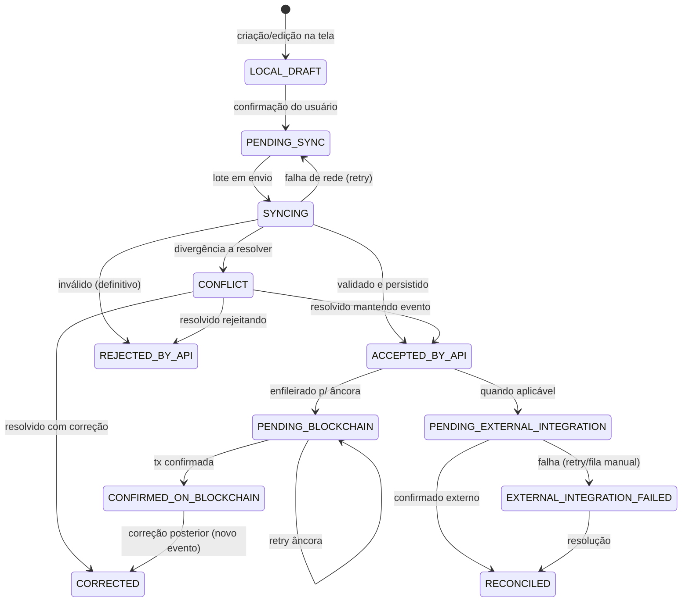
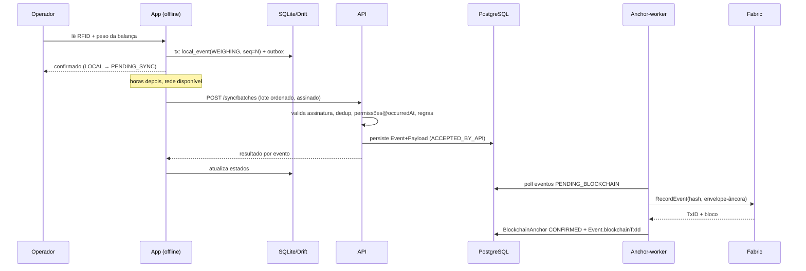
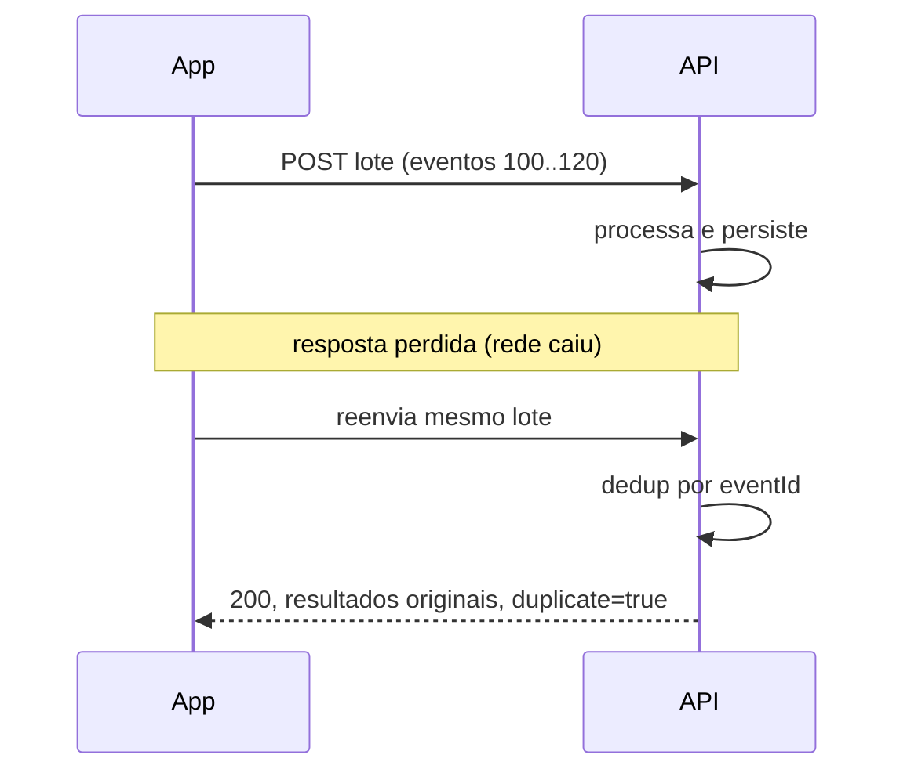

# Documento 8 — Arquitetura Offline-First

## 1. Princípios

1. O app é a fonte primária de captura; a API é o ponto de verdade consolidado.
2. Toda operação de campo funciona sem rede; conectividade só melhora latência de confirmação.
3. Nada capturado se perde: evento local persiste até aceite confirmado pela API.
4. Idempotência ponta a ponta: reenvio nunca duplica (R22, R23).
5. O servidor decide; o app antecipa. Validações locais são espelho para UX — a decisão vinculante ocorre na sincronização.

## 2. Banco local

**DECISÃO** — Drift (sobre SQLite) como camada de persistência Flutter: tipagem
forte em Dart, migrações versionadas, isolates para escrita em lote, maturidade.
SQLCipher para criptografia do arquivo (Doc 8 §8).

Esquemas locais:

| Tabela local | Conteúdo | Origem |
|--------------|----------|--------|
| `local_event` | Eventos criados no dispositivo + estado de sync | App |
| `local_event_payload` | Payload canônico serializado | App |
| `outbox` | Fila de envio (FIFO por deviceSequence) | App |
| `animal_cache`, `identifier_cache`, `lot_cache`, `property_cache` | Réplica parcial (animais das propriedades vinculadas) | Pull incremental |
| `policy_cache` | Permissões + parametrizações vigentes | Pull |
| `catalog_cache` | Produtos veterinários, raças, cortes | Pull |
| `sync_cursor` | Cursores de pull incremental por coleção | App |
| `conflict_inbox` | Conflitos retornados pela API aguardando ação | Push response |

## 3. Fila de eventos e ordenação

- `deviceSequence`: contador monotônico persistente por dispositivo, atribuído na
  criação do evento (transação atômica com a inserção). Nunca reutilizado, nem após
  reinstalação (âncora no enrolamento: servidor informa último sequence aceito).
- Envio em lotes de até 500 eventos, **ordem estrita de sequence**.
- Evento só sai da outbox após resposta da API classificando-o (aceito, rejeitado,
  conflito). Falha de rede mantém na fila.
- Eventos dependentes (ex.: REGISTER_ANIMAL → WEIGHING do mesmo animal criado
  offline) vão no mesmo lote ou em lotes ordenados; a API processa o lote em ordem
  de sequence, então dependências locais se resolvem naturalmente (R27).

## 4. Retry e backoff

| Situação | Estratégia |
|----------|-----------|
| Falha de rede / timeout | Backoff exponencial com jitter: 5s, 15s, 45s, 2min, 5min, teto 15min; retry infinito (evento nunca expira) |
| HTTP 5xx | Mesmo backoff; lote inteiro re-enviado (idempotente) |
| HTTP 429 | Respeita `Retry-After` |
| HTTP 401 (token expirado) | Refresh; se refresh falhar, pausa sync e pede login online quando houver rede; fila intacta |
| HTTP 403 dispositivo/usuário revogado | Sync bloqueada; eventos permanecem locais; fluxo §10 |
| Rejeição de negócio (400/409 por evento) | Sem retry automático — evento vai a `REJECTED_BY_API` ou `CONFLICT` para ação humana |

## 5. Estados de sincronização (máquina de estados por evento)



Regras dos estados:

- `LOCAL_DRAFT` é o **único** estado editável (coluna E da matriz Doc 7).
- A partir de `PENDING_SYNC` o evento é imutável no dispositivo.
- `REJECTED_BY_API` é terminal para aquele eventId; correção do trabalho perdido =
  novo evento. O app mostra motivo e oferece recriação pré-preenchida.
- Estados pós-aceite (`PENDING_BLOCKCHAIN` em diante) vivem no servidor; o app os
  exibe via pull, não os gerencia.

## 6. Idempotência e duplicidade

- Chave primária de deduplicação: `eventId` (UUIDv7 gerado no dispositivo).
- Chave secundária: `(deviceId, deviceSequence)` — detecta bug de app que gere novo
  UUID para o mesmo registro.
- Resposta idempotente: reenvio de evento já processado retorna o **resultado
  original** (aceito/rejeitado/conflito), status 200, flag `duplicate: true`.
- **Duplicidade lógica** (dois eventos distintos, mesmo fato — ex.: dois operadores
  pesam o mesmo animal em 3 minutos): não é rejeição automática. Heurística
  configurável (mesmo animal + mesmo tipo + janela temporal + payload similar)
  marca o segundo com `DUPLICATE_LOGICAL` em `SyncConflict` para revisão; ambos
  permanecem no histórico, projeção usa o resolvido.

## 7. Conflitos

| conflictType | Causa típica | Resolução |
|--------------|--------------|-----------|
| `DUPLICATE_LOGICAL` | Dois operadores, mesmo fato | Revisor mantém um, marca outro como duplicata (evento de invalidação, não delete) |
| `STALE_STATE` | Evento válido quando criado, estado mudou antes da sync (ex.: animal transferido) | Revisor confirma (força com justificativa) ou rejeita |
| `IDENTIFIER_TAKEN` | RFID associado a outro animal entre criação e sync | Fluxo de reidentificação/correção guiado |
| `SUBJECT_CLOSED` | Evento sobre animal encerrado | Rejeição orientada ou correção de sujeito |
| `ORDER_VIOLATION` | Lacuna de deviceSequence não preenchida na janela | Reenvio dos faltantes; suporte se perda real |
| `RECEIPT_MISMATCH` | Divergência de embarque (R16) | Fluxo de ocorrência logística |

Conflitos aparecem na central do app e no painel web; resolução exige permissão
(Doc 7) e gera AuditLog + evento de resolução.

## 8. Segurança local

- **Criptografia**: SQLCipher (AES-256) com chave no Android Keystore
  (hardware-backed quando disponível); documentos/fotos locais cifrados.
- **Chave de assinatura**: par ECDSA P-256 gerado no Keystore no enrolamento;
  privada não exportável; pública registrada no servidor (Device.publicKey).
- **Autenticação offline**: após login online, credencial derivada (PIN/biometria →
  desbloqueio da chave local). Token de sessão offline com validade máxima **72h**
  (parametrizável); expirado, o usuário ainda **captura eventos** (assinados pelo
  dispositivo) mas o app exige reautenticação online antes de sincronizar.
  **DECISÃO** — captura nunca é bloqueada por expiração de credencial; a autorização
  vinculante é validada no servidor com `occurredAt` (R28).
- **Expiração/revogação**: pull de política a cada sync; revogação de usuário ou
  dispositivo bloqueia sync imediatamente (server-side) e bloqueia o app no próximo
  contato online.

## 9. Relógio incorreto

- Em toda sync, o app compara hora local com hora do servidor (header de resposta);
  desvio > 2min: registra `clockSkew` e o exibe.
- Eventos carregam `occurredAt` do relógio local + `clockSkewAtSync` reportado no
  envelope do lote; a API armazena o desvio observado e **ajusta apenas metadados de
  análise**, nunca o `occurredAt` declarado.
- `occurredAt` no futuro (além da tolerância de 5min contra o relógio do servidor
  no aceite): evento aceito com flag `TIME_SUSPECT` e visível em auditoria;
  parametrizável para rejeição em programas estritos.
- Ordem vinculante para reconstrução é `deviceSequence` (local) + `receivedAt`
  (global), nunca apenas `occurredAt`.

## 10. Cenários de resiliência

| Cenário | Comportamento especificado |
|---------|---------------------------|
| Evento enviado 2× | Dedup por eventId ⇒ resposta idempotente (§6) |
| Dois operadores registram o mesmo fato | `DUPLICATE_LOGICAL` (§7) |
| Animal inexistente localmente (comprado ontem, cache desatualizado) | App permite **registro provisório por RFID** (`unresolvedSubject: rfidCode`); API resolve o vínculo na ingestão; se irresolúvel ⇒ `CONFLICT` |
| RFID desconhecido no brete | Fluxo "tag desconhecida": captura peso/evento com RFID bruto + foto opcional; vira conflito de resolução se não resolvido na sync |
| App fechado/morto durante sync | Lote é idempotente; na reabertura, outbox reenvia; estados reconciliados pela resposta |
| Reinicialização do dispositivo | Fila e sequence persistentes (transacionais); nada se perde |
| Bateria acaba durante gravação | Escrita transacional: evento existe completo ou não existe; UI reexibe último não confirmado |
| Perda do dispositivo | ADMO revoga no painel; dados locais cifrados (Keystore inacessível sem desbloqueio); sync do aparelho bloqueada; eventos não sincronizados são perdidos — mitigação: sync oportunista agressiva + alerta de "eventos pendentes há Xh" |
| Revogação do dispositivo com eventos pendentes legítimos | R40: outro dispositivo/usuário reemite manualmente com nova autoria citando origem; nunca importação automática da fila do dispositivo revogado |

## 11. Sincronização — modos

- **Inicial (provisioning)**: após enrolamento, pull completo do escopo (propriedades
  vinculadas, animais, catálogos, políticas). Paginação por cursor; retomável;
  estimativa de volume exibida (pode ser >100MB em fazendas grandes — exigir Wi-Fi é
  opção do usuário).
- **Incremental**: cursores por coleção (`updatedSince` + id de desempate);
  delta a cada oportunidade de rede e antes de operações críticas (montar embarque).
- **Em lote (push)**: §3. Prioridade de fila: conflitos/pendências de recebimento >
  eventos sanitários com carência > demais, FIFO dentro da prioridade.

## 12. Diagramas de sequência

### 12.1 Pesagem offline → sincronização → âncora



### 12.2 Vacinação offline com carência

```mermaid
sequenceDiagram
    participant VE as Veterinário
    participant APP as App
    participant API as API
    VE->>APP: seleciona lote + produto (catalog_cache)
    APP->>APP: valida credencial local (policy_cache) + gera 1 evento/animal (batchId)
    APP->>APP: cria WITHDRAWAL local derivado (carência do produto)
    Note over APP: bloqueios locais já valem p/ expedição offline
    APP->>API: sync do lote
    API->>API: revalida credencial em occurredAt (R17/R28)
    API-->>APP: aceitos; WithdrawalPeriod oficial criado
```

### 12.3 Conflito de identificador

```mermaid
sequenceDiagram
    participant APP as App A
    participant API as API
    participant W as Painel Web
    APP->>API: LINK_IDENTIFIER (rfid X → animal 1)
    Note over API: rfid X já ativo no animal 2 (App B sincronizou antes)
    API-->>APP: CONFLICT IDENTIFIER_TAKEN + estado atual
    APP->>APP: conflict_inbox; evento congelado
    W->>API: PROD resolve: REIDENTIFICATION correta ou rejeição
    API-->>APP: pull atualiza estado final + AuditLog
```

### 12.4 Duplicidade física de envio



### 12.5 Correção pós-sincronização

```mermaid
sequenceDiagram
    participant U as Usuário
    participant APP as App/Web
    participant API as API
    participant AW as Anchor-worker
    U->>APP: corrige peso 4200→420 (erro de digitação)
    APP->>API: CORRECTED{targetEventId, correctedFields}
    API->>API: valida janela/permissão; marca original corrected=true
    API->>API: recalcula projeções (peso, GMD)
    AW->>AW: ancora o evento CORRECTED (original permanece ancorado)
```

### 12.6 Integração externa com falha

```mermaid
sequenceDiagram
    participant API as API
    participant Q as Fila
    participant AD as sisbov-adapter
    participant EXT as SISBOV
    API->>Q: evento aceito exige registro externo
    Q->>AD: job
    AD->>EXT: request (logado R31)
    EXT-->>AD: timeout/5xx
    AD->>Q: retry backoff (máx N tentativas)
    AD->>API: estado EXTERNAL_INTEGRATION_FAILED + fila de erro
    Note over API: evento interno intacto (R30); operação manual possível (Doc 12)
```

## 13. Critérios de aceite do módulo

1. 48h em modo avião: todas as operações de campo executáveis; fila íntegra após reinício.
2. Queda de rede em qualquer ponto da sync não gera duplicata nem perda (teste com proxy caótico).
3. Fila de 50.000 eventos: app permanece responsivo (<16ms frame em listas), sync completa.
4. Relógio adiantado 2 dias: eventos aceitos com flag; relatório de skew disponível.
5. Dispositivo revogado: bloqueio na próxima tentativa de sync ≤1 requisição.
6. Todos os cenários da §10 cobertos por testes automatizados (Doc 15).
