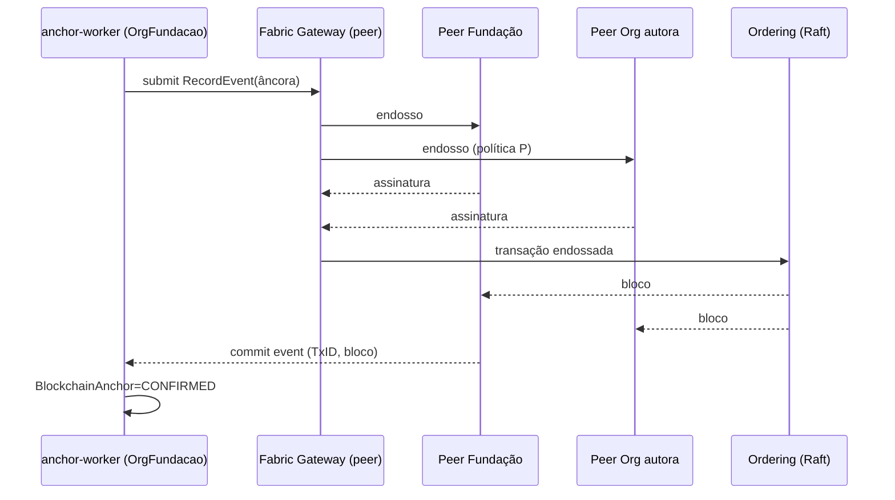

# Documento 10 — Arquitetura Hyperledger Fabric

## 1. Papel da rede

A rede Fabric é a camada de **prova e endosso interorganizacional** (Doc 1 §8).
Armazena registros-âncora (Doc 11), nunca payloads completos. Sem mineração, sem
criptomoeda, sem token.

## 2. Organizações da rede

| Org (MSP ID) | Papel | Peers | Observação |
|--------------|-------|-------|------------|
| `OrgFundacaoMSP` | Governança, operação da plataforma | 2 endorsing/committing | Administra canal com as demais |
| `OrgProdutoresMSP` | Representação dos produtores (cooperativa/associação) | 2 | **PREMISSA**: entidade coletiva; produtores individuais não operam peers |
| `OrgCertificadoraMSP` | Certificadora | 2 | Endossa eventos de certificação e sensíveis |
| `OrgFrigorificoMSP` | Frigorífico | 2 | Entra na Fase 6 |
| `OrgAuditoriaMSP` (opcional) | Auditoria independente | 1 committing (não endossante) | Cópia completa do ledger para verificação |
| `OrgPublicaMSP` (condicionada) | Órgão público | — | **Somente mediante acordo formal**; nunca presumida |

**Descentralização institucional — aviso obrigatório**: múltiplos peers/orderers
operados pela **mesma instituição** (ainda que em datacenters distintos) são
redundância, **não descentralização**. A rede só oferece garantia interorganizacional
quando organizações **juridicamente independentes** operam seus próprios nós com
seus próprios administradores e CAs. Até a Fase 4, a rede deve ser descrita
publicamente como "âncora criptográfica operada pela fundação", nunca como "rede
descentralizada". (RISCO R4, Doc 1.)

## 3. Topologia

| Componente | Dev (Fase 1) | Piloto 3 orgs (Fase 4) | Produção (Fase 7) |
|------------|--------------|------------------------|-------------------|
| Peers | 1 (OrgFundacao) | 2 por org (6) | 2 por org, AZs distintas |
| Ordering | 1 nó Raft | 3 nós Raft (1 por org: Fundação, Produtores, Certificadora) | 5 nós Raft distribuídos entre orgs |
| Fabric CA | 1 raiz dev | 1 CA por org (raiz offline + intermediária online) | Idem + HSM para raiz |
| CouchDB/StateDB | CouchDB | CouchDB por peer | CouchDB por peer |
| Canais | `traceagro-main` | `traceagro-main` | `traceagro-main` (+ canais bilaterais se necessário) |

- **Endorsing peers**: peers das orgs listadas na política do chaincode.
- **Committing peers**: todos os peers do canal (incluindo OrgAuditoria).
- **Fabric Gateway** (serviço do peer, Fabric ≥2.4): ponto de entrada dos serviços
  backend; o SDK Gateway gerencia endosso/submissão/commit.

## 4. Identidade e MSP

- Cada org opera sua **Fabric CA**: raiz offline, intermediária emite identidades
  de peers, orderers, admins e **identidades de serviço**.
- **Identidade dos serviços**: o backend da plataforma transaciona com identidade
  `svc-api@OrgFundacaoMSP` (client). Eventos originados por outra org e que exigem
  a assinatura Fabric daquela org (endosso reforçado) passam pelo **gateway daquela
  org** ou por serviço de assinatura da org — a assinatura do usuário final é a do
  envelope do evento (ECDSA do dispositivo), verificada pelo chaincode como dado,
  não como identidade Fabric. **DECISÃO**: usuários finais não recebem identidades
  Fabric individuais (escala e UX); a autoria fina é garantida pela assinatura de
  dispositivo dentro do payload ancorado.
- **Certificados**: X.509, validade 12 meses para serviços, 24 para peers; rotação
  automatizada com sobreposição.
- **Revogação**: CRL publicada pela CA da org; propagação ≤1h para todos os peers;
  identidade revogada falha em endosso e submissão.

## 5. Chaincode

**DECISÃO** — chaincode em **Go**. Justificativa: runtime maduro e determinístico
no Fabric, menor overhead que Node no peer, tipagem forte sem transpile, e a base
de exemplos/ferramentas do ecossistema Fabric é Go-first. TypeScript concentraria a
stack, mas o chaincode é código pequeno, crítico e raramente alterado — prioridade
é robustez, não homogeneidade.

- Nome: `traceagro-cc`; versionamento semântico; upgrade pelo ciclo Fabric 2.x
  (package → install → approveformyorg → commit) exigindo aprovação de **maioria
  das orgs** do canal.
- Estado (chave → valor): `animal:{animalId}`, `event:{eventId}`,
  `doc:{documentId}`, `custody:{animalId}`, `ownership:{animalId}`,
  `carcass:{carcassId}`, `cutlot:{cutLotId}` — valores são registros-âncora
  (Doc 11 §2), nunca payloads.

## 6. Funções do chaincode

Colunas: entradas · identidade autorizada (MSP) · validações · estado lido/escrito ·
evento Fabric emitido · erros.

| Função | Entradas | MSP autorizado | Validações principais | Estado | Evento emitido | Erros |
|--------|----------|----------------|----------------------|--------|----------------|-------|
| `RegisterAnimal` | animalId, payloadHash, orgId, ts, sig | Fundação, Produtores | animalId inédito; hash formato; sig presente | escreve `animal:` + `event:` | `AnimalRegistered` | `ALREADY_EXISTS`, `INVALID_HASH` |
| `LinkPhysicalIdentifier` | animalId, identifierHash*, eventId, hash, ts | Fundação, Produtores | animal existe e aberto | escreve `event:`, atualiza índice de identificador | `IdentifierLinked` | `NOT_FOUND`, `CLOSED`, `IDENTIFIER_ACTIVE` |
| `ReidentifyAnimal` | animalId, oldIdHash, newIdHash, reason, eventId, hash | Fundação+Produtores (**R**) | vínculo antigo ativo; novo livre | idem | `AnimalReidentified` | idem |
| `RecordEvent` | eventId, animalId/subjectId, eventType, hash, orgId, ts, sig, correctionOf? | org autora + Fundação | eventId inédito; sujeito existe; tipo permitido ao MSP | escreve `event:` | `EventRecorded` | `DUPLICATE`, `NOT_FOUND`, `TYPE_NOT_ALLOWED` |
| `RecordHealthEvent` | como RecordEvent + credentialRef | org autora + Fundação | credentialRef presente para tipos privativos | `event:` | `HealthEventRecorded` | + `CREDENTIAL_REQUIRED` |
| `RecordMovement` | shipmentId, animalIds[], phase(DISPATCH/RECEIVE), hash | org origem/destino + Fundação (**R**) | fase coerente com estado do shipment | `event:` + `custody:` | `MovementRecorded` | `PHASE_MISMATCH` |
| `TransferCustody` | animalId, fromOrg, toOrg, eventId, hash | org cedente + Fundação (**R**) | custódia atual = fromOrg | `custody:` | `CustodyTransferred` | `NOT_CUSTODIAN` |
| `TransferOwnership` | animalId, fromOrg, toOrg, proposalEventId, acceptEventId, hash | **ambas as orgs** + Fundação (**R**) | proposta+aceite presentes; dono atual = fromOrg | `ownership:` | `OwnershipTransferred` | `NOT_OWNER`, `NO_ACCEPTANCE` |
| `CorrectEvent` | correctionEventId, targetEventId, hash | org autora + Fundação | alvo existe e é corrigível; cadeia linear | `event:` novo + flag no alvo | `EventCorrected` | `NOT_CORRECTABLE` |
| `AttachDocumentProof` | documentId, sha256, subjectRef, version, eventId | org autora + Fundação | doc inédito na versão | `doc:` | `DocumentAnchored` | `VERSION_EXISTS` |
| `RecordTransformation` | carcassId/cutLotId, originRefs[], weights, hash | Frigorífico + Fundação (**R**) | origem abatida; carcaça única; balanço de massa (limites) | `carcass:`/`cutlot:` | `TransformationRecorded` | `ORIGIN_INVALID`, `MASS_BALANCE` |
| `CloseLifecycle` | animalId, cause(SLAUGHTER/DEATH), eventId, hash | org custodiante + Fundação (**R**) | animal aberto | `animal:` status terminal | `LifecycleClosed` | `ALREADY_CLOSED` |
| `VerifyProof` (query) | subjectId ou eventId, hash? | qualquer MSP do canal | — | leitura | — | `NOT_FOUND` |

\* identificadores físicos sobem como hash/valor controlado conforme Doc 11 (RFID é
identificador controlado, permitido on-chain; CPF de proprietário PF jamais).

## 7. Private Data Collections (PDC)

| Coleção | Membros | Conteúdo | Uso |
|---------|---------|----------|-----|
| `pdc-commercial` | Produtores + Frigorífico | Hash de documentos comerciais de transferência (o documento e o preço ficam off-chain; aqui apenas âncora restrita) | Transferências com confidencialidade entre as partes |
| `pdc-certification-detail` | Certificadora + Fundação | Referências detalhadas de dossiê em avaliação | Certificação antes da emissão pública |

Regra: PDC guarda **hashes e referências restritas**, nunca o dado sensível em si;
o dado vive no storage off-chain com ACL. Purge de PDC não é usado como mecanismo
LGPD primário (Doc 13 trata exclusão).

## 8. Políticas

| Política | Definição |
|----------|-----------|
| Endosso padrão (P) | `AND(OrgFundacaoMSP.peer, OR(<MSP da org autora>.peer))` — evento só é ancorado se a fundação e a org autora endossarem |
| Endosso reforçado (R) | Conforme função (§6): envolve as **duas partes do fato** (ex.: TransferOwnership exige cedente E adquirente E fundação) |
| Lifecycle do chaincode | `MAJORITY Admins` do canal |
| Canal (leitura/escrita) | Membros do canal; OrgAuditoria: somente leitura/commit |
| Bloqueio de bypass | Nenhuma org sozinha satisfaz política alguma — inclusive a Fundação |

## 9. Entrada e saída de organizações

- **Entrada**: acordo jurídico → geração de MSP/CA própria → proposta de atualização
  de configuração do canal → assinaturas conforme política de canal (maioria) →
  join dos peers → sincronização do ledger (dias, dependendo do volume).
- **Saída voluntária**: remoção do MSP da configuração; blocos históricos
  permanecem válidos (assinaturas antigas verificáveis pela cadeia de certificados
  preservada na configuração histórica).
- **Expulsão** (violação de acordo): mesma mecânica, decidida por maioria; registrar
  publicamente o motivo em ata de governança (fora da chain).

## 10. Operação

| Aspecto | Especificação |
|---------|---------------|
| Backup | Snapshot dos ledgers dos peers + CouchDB + material criptográfico das CAs (raiz offline em cofre físico); diário; teste de restauração trimestral obrigatório |
| Restauração | Peer novo re-junta o canal e sincroniza do ordering/peers; CA restaurada de backup cifrado; runbook testado (Doc 15) |
| Monitoramento | Métricas Prometheus nativas de peer/orderer (altura de bloco, latência de endosso, falhas); alerta se divergência de altura entre peers >10 blocos ou >5min |
| Atualização de chaincode | Janela coordenada; approveformyorg de cada org registrado; rollback = commit de versão anterior |
| Upgrade de Fabric | Rolling por org; compatibilidade N-1 validada em homologação |
| DR | Peers redundantes por org em AZ distinta; ordering Raft tolera minoria indisponível ((n-1)/2) |

## 11. Fluxo de ancoragem (referência)

**QUESTÃO EM ABERTO** — hospedagem dos peers das orgs não-fundação nas Fases 4–6:
infra própria de cada org (ideal, mais atrito) vs. hospedagem segregada com chaves
administradas pela org (pragmático, exige contrato claro). Decidir na Fase 0/4 com
as organizações candidatas.
