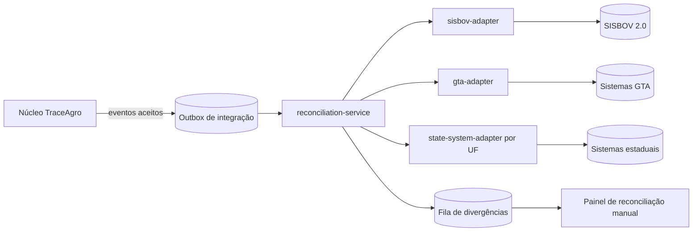

# Documento 12 — Integração SISBOV, GTA e Sistemas Estaduais

## 1. Postura

**PREMISSA** — nenhuma API oficial é assumida como disponível. Todo o núcleo da
plataforma funciona sem integração oficial; as integrações **agregam** reconciliação,
nunca são pré-requisito (R29, R30). Nada neste documento afirma validade oficial de
registro sem homologação formal junto ao órgão competente.

## 2. Dependências externas (bloqueantes por integração)

| # | DEPENDÊNCIA EXTERNA | Detalhe |
|---|---------------------|---------|
| I1 | Certificadora/entidade credenciada SISBOV | A plataforma não acessa o SISBOV em nome próprio; opera sob credencial de entidade habilitada, com responsabilidade jurídica definida em contrato |
| I2 | Credenciais SISBOV 2.0 | Access Key + Secret Key; emissão condicionada a I1 |
| I3 | Autenticação | JWT obtido com as credenciais; renovação e expiração conforme o serviço |
| I4 | IP liberado | Allowlist de IPs de saída fixos (NAT gateway dedicado) |
| I5 | Ambiente de homologação | Acesso formal antes de qualquer produção |
| I6 | Limites de uso | Quotas/rate limits do órgão — desconhecidos até o acordo; adaptador projetado para operar sob limite configurável |
| I7 | Acordos por UF (GTA/estaduais) | Cada UF: sistema, protocolo (API, arquivo, portal) e acordo próprios |
| I8 | Responsabilidade jurídica | Quem responde por registro incorreto no sistema oficial — contrato com a certificadora; **QUESTÃO EM ABERTO** jurídica |

## 3. Arquitetura de adaptadores

Princípios:

- Adaptadores são serviços isolados (deploy e falha independentes do núcleo);
  conhecem o protocolo externo e o mapeamento de campos; não conhecem regras de
  negócio internas.
- Comunicação núcleo→adaptador exclusivamente via outbox/fila (padrão transactional
  outbox): evento aceito grava intenção de integração na mesma transação.
- `reconciliation-service` orquestra: decide o que enviar, confronta retornos,
  classifica divergências, alimenta a fila de erro e o painel manual.
- Novo estado/UF = novo adaptador implementando a mesma interface
  (`submit`, `query`, `mapFields`, `healthcheck`) sem alteração no núcleo.

## 4. Mapeamento de campos (SISBOV — referência)

| Campo interno | Campo oficial | Transformação |
|---------------|---------------|---------------|
| `officialAnimalId` | Número SISBOV | Direto; validação de dígito |
| `Animal.birthDate` | Data de nascimento | ISO → formato do serviço |
| `Animal.sex`, `breedCode` | Sexo, raça | Tabela de-para versionada (catálogo oficial de raças) |
| `Property.officialPropertyCode` | Código do estabelecimento | Direto |
| `REGISTER_ANIMAL` | Inclusão de animal | Composição de campos |
| `REIDENTIFICATION` | Troca de identificação | Mapeia motivo para códigos oficiais |
| `SHIPMENT_*` + `GTARecord` | Movimentação | Nº GTA + série + UF + datas |
| `SLAUGHTER/DEATH` | Baixa | Causa mapeada |

Tabelas de-para são dados versionados com vigência (R41), não código.

## 5. Estados de integração (por registro integrável)

`NOT_APPLICABLE → PENDING_EXTERNAL_INTEGRATION → SUBMITTED → CONFIRMED → RECONCILED`
com desvios `EXTERNAL_INTEGRATION_FAILED` (retry) e `DIVERGENT` (fila manual).
Estados alinhados aos do Documento 8 §5.

## 6. Resiliência e trilha (R30, R31)

| Aspecto | Especificação |
|---------|---------------|
| Timeout | Configurável por adaptador (padrão 30s); circuito aberto após 5 falhas consecutivas, sonda a cada 5min |
| Retry | Backoff exponencial 1min→1h, máx. 24 tentativas automáticas; depois fila de erro manual |
| Idempotência externa | Antes de reenviar, `query` verifica se o registro já existe no destino (evita duplicar no oficial) |
| Log de tentativa | Tabela `integration_attempt`: adapterId, registro interno, request (sanitizado), response, HTTP status, tentativa nº, duração, timestamp — retenção 5 anos |
| Falha ≠ perda | Evento interno permanece aceito e ancorado; só o espelhamento fica pendente |
| Rate limit | Token bucket por adaptador respeitando I6 |

## 7. Reconciliação e divergência

- **Job periódico** (diário e sob demanda): consulta base oficial para o escopo
  (animais/movimentações da propriedade) e confronta com o interno.
- Classificação de divergência: `MISSING_EXTERNAL` (existe interno, falta oficial),
  `MISSING_INTERNAL` (existe oficial, falta interno), `FIELD_MISMATCH` (dados
  diferem), `STATE_MISMATCH` (baixado num lado só).
- Cada divergência vira item da fila com evidências dos dois lados; resolução
  manual pelo painel (ADMO/CERT, Doc 7) gera: reenvio, evento interno de correção,
  ou marcação "oficial prevalece" — sempre com AuditLog.
- Métricas: taxa de reconciliação automática (meta ≥99% em homologação — Doc 2 §13),
  idade média da fila de divergências.

## 8. Critérios de aceite

1. Derrubar o adaptador em pleno fluxo: zero eventos internos perdidos ou bloqueados.
2. Resposta 500/timeout/parcial do serviço externo: retry conforme política, sem duplicação externa (verificação por query antes de reenvio).
3. Toda tentativa consultável com request/response sanitizados (sem segredos, sem dados pessoais além do necessário).
4. Divergência plantada em homologação aparece na fila em ≤24h com evidências.
5. Registro manual de GTA (upload) funciona de ponta a ponta **sem nenhum adaptador ativo** — comprovando independência do núcleo.
