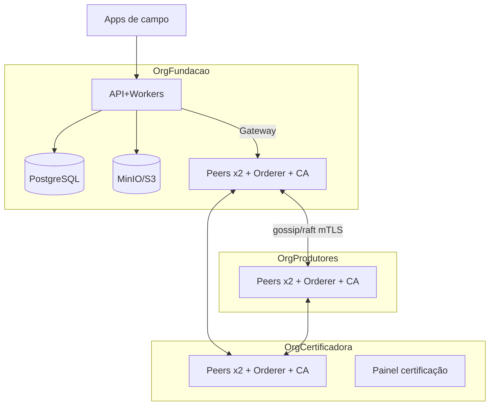

# Documento 14 — Infraestrutura e DevOps

## 1. Ambientes

| Ambiente | Propósito | Infra | Dados | Fabric |
|----------|-----------|-------|-------|--------|
| local | Desenvolvedor | Docker Compose | Sintéticos | 1 peer dev (ou mock de âncora) |
| dev | Integração contínua | K8s (namespace) ou VM única | Sintéticos | 1 org simplificada |
| test | Testes automatizados E2E | Efêmero por pipeline | Gerados por seed | Rede efêmera |
| homolog | Validação de release + integrações oficiais (I5) | Espelho reduzido de produção | Anonimizados/sintéticos | 2 orgs |
| piloto | Fase 3–4 com dados reais | VMs ou K8s gerenciado | Reais | 1→3 orgs |
| prod | Produção | K8s gerenciado, multi-AZ | Reais | Topologia Doc 10 §3 |
| dr | Disaster recovery | Região secundária, standby | Réplica | Peers redundantes das orgs |

**DECISÃO** — Piloto em VMs com Docker Compose por org (simplicidade e custo);
migração para Kubernetes no gate da Fase 7. Fabric em produção via operador
(Fabric Operator/Bevel) ou charts mantidos — avaliar no gate.

## 2. Componentes e artefatos

| Componente | Artefato | Observação |
|------------|----------|------------|
| API core (NestJS) | Dockerfile multi-stage (node:22-slim, distroless runtime), imagem única, config por env | Réplicas ≥2 em prod |
| Workers (anchor, projeções, relatórios) | Mesma base, entrypoints distintos | Escala independente |
| Adaptadores (sisbov, gta, state) | Imagens próprias | IP de saída fixo (I4) |
| PostgreSQL + PostGIS | Gerenciado (RDS/CloudSQL) em prod; container em dev | v16+, particionamento Doc 4 §7 |
| Storage de objetos | MinIO (local/dev/piloto) → S3 compatível (prod) | Versionamento + lock WORM p/ classes exigidas |
| Mensageria | **DECISÃO**: Redis + BullMQ até a Fase 5; reavaliar Kafka/NATS se volume exigir | Outbox pattern cobre atomicidade |
| Keycloak | Container dedicado, banco próprio | Realm versionado (export no repo) |
| Fabric | cryptogen **proibido fora de local**; CAs reais desde dev | Doc 10 |
| Observabilidade | Prometheus + Grafana + Alertmanager; Loki (logs); Tempo/OTel (traces) | correlationId em tudo (Doc 9) |

## 3. Topologias propostas

### 3.1 Local do desenvolvedor (Docker Compose)

`compose.dev.yml`: api, worker, postgres+postgis, minio, keycloak, redis,
fabric-dev (1 peer + 1 orderer + 1 CA, canal único) ou `ANCHOR_MODE=mock`.
Seed de dados sintéticos por script. Sobe com um comando; hot-reload da API.

### 3.2 Laboratório de uma organização (Fases 1–3)

1 VM aplicação (api+workers+redis), 1 VM dados (postgres, minio, backups),
1 VM Fabric (peer×2, orderer×1, CA) — todas da OrgFundacao. TLS interno,
Prometheus/Grafana na VM de aplicação. Suficiente para o piloto de propriedade.

### 3.3 Piloto com três organizações (Fase 4)

Cada org hospeda seus nós Fabric (ou hospedagem segregada — QUESTÃO EM ABERTO do
Doc 10 §11). Plataforma aplicacional permanece na fundação nesta fase.

### 3.4 Produção distribuída (Fase 7)

- K8s multi-AZ para aplicação (API, workers, adaptadores, Keycloak), HPA por fila/CPU.
- Postgres gerenciado com réplica de leitura + standby cross-region (DR).
- S3 com replicação cross-region.
- Fabric: topologia Doc 10 §3 (2 peers/org em AZs distintas, 5 orderers Raft
  distribuídos entre orgs, CAs com raiz em HSM).
- Borda: WAF + CDN para endpoints públicos (QR).

## 4. CI/CD

| Etapa | Conteúdo |
|-------|----------|
| CI (toda PR) | Lint, typecheck, testes unitários, testes de contrato OpenAPI (breaking-change check), teste de schema de âncora (R21), secret scanning, SCA, build de imagens |
| CI (main) | Testes de integração com Compose efêmero (Postgres, Redis, MinIO, Fabric efêmero), testes E2E API, publicação de imagens assinadas (cosign) |
| CD | GitOps (ArgoCD/Flux): dev automático → homolog com aprovação → prod com aprovação dupla + janela; migrações de banco versionadas (expand/contract, nunca destrutivas em release única) |
| App Flutter | Pipeline própria: testes, build assinado, distribuição interna (Firebase App Distribution) → Play Store faixas internal/closed/production |
| Chaincode | Pipeline separada: testes Go, build, proposta de upgrade coordenada (aprovação por org — Doc 10 §5) |

## 5. Observabilidade e alertas

| Sinal | Alerta (exemplos) |
|-------|-------------------|
| API | p95 >800ms 5min; taxa 5xx >1%; fila de ingestão crescendo |
| Sync | lotes falhando por dispositivo; eventos PENDING_SYNC >24h (agregado por org) |
| Âncora | eventos ACCEPTED sem CONFIRMED >30min; divergência de altura de bloco entre peers |
| Integrações | circuito aberto >1h; fila de divergências >N |
| Dados | replicação atrasada; disco; falha de backup (alerta crítico) |
| Segurança | picos de 401/403; enumeração no QR público; login administrativo fora de padrão |

Dashboards mínimos: saúde da API, funil de sincronização (por estado do Doc 8 §5),
saúde Fabric, filas, integrações, negócio (eventos/dia por tipo e org).

## 6. Backup e recuperação

| Alvo | Estratégia | Teste |
|------|-----------|-------|
| PostgreSQL | Backup completo diário + WAL contínuo (PITR, RPO ≤5min) | Restauração trimestral em ambiente isolado com verificação de contagens |
| Objetos | Versionamento + replicação cross-region | Restauração amostral trimestral |
| Fabric | Doc 10 §10 (snapshots + material de CA em cofre) | Peer restore trimestral; simulação de perda de org anual |
| Keycloak | Export de realm + backup do banco | Junto com o ciclo do Postgres |
| Evidência | Todo teste de restauração gera relatório arquivado (auditoria) | — |
