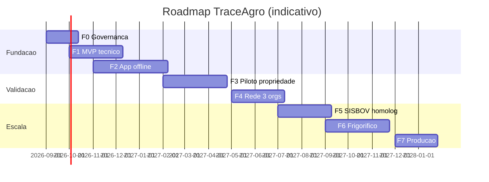

# Documento 16 — Roadmap

Durações são estimativas de planejamento com equipe indicada; validar no gate da
Fase 0. Fases 1–2 podem sobrepor parcialmente (backend e mobile em paralelo após
contratos congelados).

## Fase 0 — Governança e definição (4–6 semanas)

| Item | Conteúdo |
|------|----------|
| Objetivo | Fechar decisões estruturais antes de escrever código |
| Entregáveis | Aprovação desta documentação; decisões do Doc 17; acordo-quadro com certificadora e org de produtores; DPO designado; contratos DPA modelo; seleção de hardware de referência (leitor + balança + brinco) |
| Equipe | CPO, arquiteto, jurídico, 1 tech lead |
| Riscos | Paralisia por dependências externas → prosseguir com premissas explícitas |
| Dependências | Diretoria; candidatos a parceiros |
| Gate | Doc 17 aprovado item a item; orçamento das Fases 1–3 liberado |

## Fase 1 — MVP técnico (8–10 semanas)

| Item | Conteúdo |
|------|----------|
| Objetivo | Núcleo evento-orientado funcionando ponta a ponta em ambiente de laboratório |
| Entregáveis | API NestJS (módulos identidade, orgs, propriedades, animais, eventos, documentos); Postgres+projeções; Keycloak; MinIO; ingestão idempotente; catálogo de eventos v1; Fabric 1 org com chaincode `traceagro-cc` v0 e âncora automática; CI/CD; ambiente compose local |
| Equipe | 1 tech lead, 3 backend, 1 DevOps, 1 QA |
| Riscos | Subestimar pipeline de ingestão (coração do sistema) → começar por ele |
| Dependências | Nenhuma externa |
| Gate | Critério de sucesso "MVP" (Doc 1 §10): ciclo completo de 1 animal com âncora; testes Fase 1 verdes |

## Fase 2 — Aplicativo de campo offline (10–14 semanas, sobrepõe F1 após semana 4)

| Item | Conteúdo |
|------|----------|
| Objetivo | App Flutter operacional offline com RFID e balança |
| Entregáveis | App Android (Drift+SQLCipher, outbox, assinatura no Keystore, enrolamento de dispositivo); drivers leitor RFID (BLE/USB/serial) e balança; fluxos UC-01..04; sincronização completa (Doc 8); central de conflitos (app + web mínimo) |
| Equipe | 2–3 Flutter, 1 backend (sync), 1 QA (+ bancada de hardware) |
| Riscos | Diversidade de hardware → restringir a modelos de referência da Fase 0 |
| Dependências | Hardware de referência adquirido |
| Gate | Testes RFID + Offline (Doc 15 §2–3) verdes em bancada; 48h modo avião comprovado |

## Fase 3 — Piloto em uma propriedade (8–12 semanas de operação)

| Item | Conteúdo |
|------|----------|
| Objetivo | Operação real: ≥500 animais, 30+ dias contínuos |
| Entregáveis | Propriedade onboarded; identificação do rebanho; rotina de pesagem/sanidade/manejo no app; relatório de aprendizados; ajustes de UX priorizados |
| Equipe | Equipe F1+F2 em sustentação + 1 pessoa de campo (treinamento/suporte) |
| Riscos | R3 (adoção) — mitigar com presença em campo nas 2 primeiras semanas; conectividade pior que o previsto → validar sync oportunista |
| Dependências | Propriedade parceira contratada; brincos aplicados |
| Gate | ≥95% sync limpa; NPS do operador de campo aceitável; decisão go/no-go da diretoria para rede multi-org |

## Fase 4 — Rede com três organizações (8–10 semanas)

| Item | Conteúdo |
|------|----------|
| Objetivo | Descentralização institucional real: Fundação + Produtores + Certificadora |
| Entregáveis | CAs e peers por org (Doc 10); políticas de endosso P e R ativas; módulo de certificação com endosso; painel da certificadora; runbooks de operação multi-org; acordo de governança assinado |
| Equipe | 1 blockchain/infra dedicado, 2 backend, DevOps, + contato técnico por org |
| Riscos | R4/QUESTÃO Doc 10 §11 (hospedagem dos peers) — decidir no início da fase |
| Dependências | D5 (orgs dispostas); acordo de governança |
| Gate | Critério "Rede" (Doc 1 §10): nenhuma transação com endosso de uma única org; testes Blockchain (Doc 15 §6) verdes |

## Fase 5 — SISBOV/GTA em homologação (6–10 semanas, dependente de credenciais)

| Item | Conteúdo |
|------|----------|
| Objetivo | Adaptadores oficiais operando em ambiente de homologação |
| Entregáveis | sisbov-adapter, gta-adapter, reconciliation-service, painel de divergências; de-paras versionados; trilha integration_attempt |
| Equipe | 2 backend, 1 QA |
| Riscos | I1–I8 (Doc 12 §2) — cronograma refém do órgão/certificadora; **iniciar gestões na Fase 0** |
| Dependências | Credenciais de homologação (D1/D2) |
| Gate | ≥99% reconciliação automática em homologação; testes Integrações (Doc 15 §7) verdes |

## Fase 6 — Frigorífico e pós-abate (8–12 semanas)

| Item | Conteúdo |
|------|----------|
| Objetivo | Cadeia completa até o corte com verificação pública |
| Entregáveis | OrgFrigorifico na rede; módulos 24–26 (recepção, abate, carcaça, lotes de corte, QR GS1 Digital Link); página pública; balanço de massa |
| Equipe | 2 backend, 1 Flutter/web, 1 integração de planta |
| Riscos | Integração com sistemas da planta (balanças de carcaça, ERP) heterogênea → começar com registro manual assistido |
| Dependências | D4 (frigorífico parceiro) |
| Gate | Trilha animal→corte verificável por QR ≤3s; testes de balanço de massa verdes |

## Fase 7 — Produção (6–8 semanas de hardening + go-live)

| Item | Conteúdo |
|------|----------|
| Objetivo | Operação comercial |
| Entregáveis | Migração K8s multi-AZ; DR ativo e testado; pentest externo; SLOs e on-call; onboarding self-service de propriedades; documentação de operação |
| Equipe | Núcleo + SRE |
| Riscos | Custo de operação (R5) — revisão de dimensionamento no gate |
| Dependências | Aprovação comercial da diretoria |
| Gate | Pentest sem críticos; DR testado com evidência; RNFs de produção atingidos |

## Fase 8 — Expansão agrícola (contínua, pós-produção)

| Item | Conteúdo |
|------|----------|
| Objetivo | Generalizar o motor de eventos para cadeias vegetais (grãos, café) |
| Entregáveis | Abstração de sujeito rastreável (lote de talhão, silo, beneficiamento); novos catálogos de eventos; EPCIS 2.0 como referência de interoperabilidade externa |
| Riscos | Generalização prematura — só iniciar com demanda comercial concreta |
| Gate | Business case aprovado por cadeia |

## Linha do tempo indicativa

