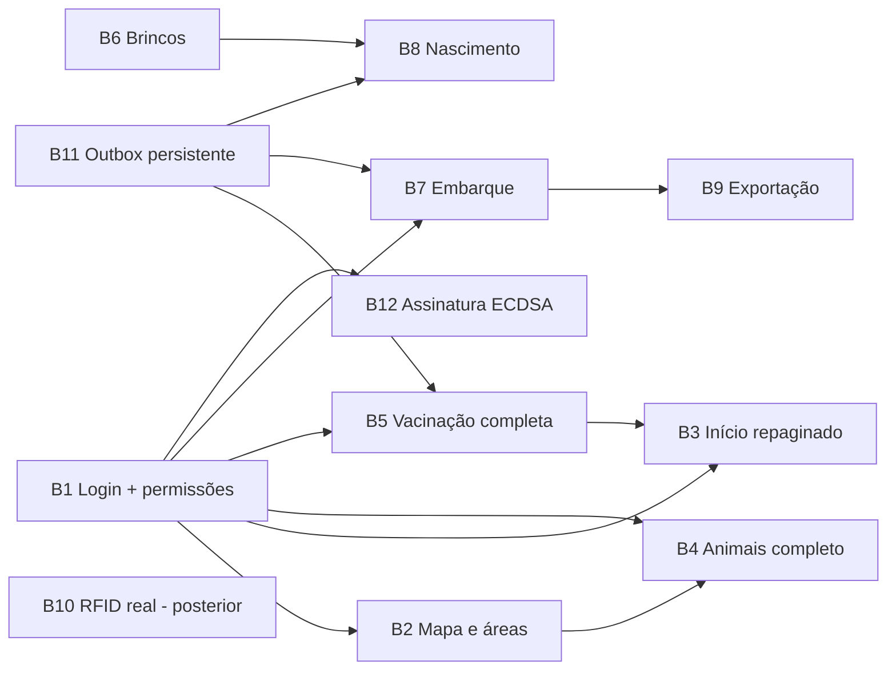

# Documento 19 — Backlog de Implementação

Catálogo dos pedidos do produto registrados em 2026-07-31, especificados para
execução por outra equipe/agente. Cada item referencia a especificação original
(Docs 3, 5, 7, 8, 9) — **este documento não substitui aquelas; ele prioriza e
recorta**. Antes de codificar qualquer item: ler `AGENTS.md` (convenções e
design system) e `docs/18-IMPLEMENTACAO-ATUAL.md` (o que já existe).

## 0. Ordem recomendada e dependências

Sugestão de ondas: **Onda 1** = B1 + B11 (fundação). **Onda 2** = B5 + B6 + B2.
**Onda 3** = B7 + B8 + B3 + B4. **Onda 4** = B9 + B12. B10 fica para depois,
por decisão do produto (hardware real será tratado à parte).

---

## B1 — Login e permissões de usuário

**Pedido**: "implementação para poder fazer um login e na questão das permissões
de usuários".

- **Especificação base**: Doc 3 §1 (identidade e acesso), Doc 7 (matriz RBAC/ABAC completa), Doc 9 §4.1.
- **Escopo**:
  1. Keycloak no `compose.dev.yml` (realm exportado no repositório, clients: app mobile com PKCE, api com client credentials).
  2. API: guard JWT (JWKS), decorators de permissão `module.action`, avaliação temporal (R28) usando vínculos com vigência (`user_role_binding` — criar migração).
  3. App: fluxo Authorization Code + PKCE (pacote `flutter_appauth` ou equivalente); sessão persistida; PIN offline (Doc 8 §8 — pode ficar para junto de B11); tela de login na identidade visual do AGENTS.md.
  4. **Substituir `DevIdentity`**: organizationId/actorId passam a vir da sessão; deviceId do enrolamento (manter fixture de dispositivo até B12).
  5. Papéis mínimos nesta fase: OPER, PROD, VETE, ADMO (subconjunto do Doc 7 §2).
- **Aceite**: sem sessão, nada além do login abre; evento sincronizado carrega actorId real; usuário OPER não consegue criar evento de sanidade privativo (403 com `ERR-SAN-001`); revogação bloqueia sync na tentativa seguinte; capturas do login aprovadas contra AGENTS.md.

**Estado: em andamento.** Entregue: sessão obrigatória no app/API, JWT dev com
login individual por e-mail e senha (hash scrypt no banco), JWKS OIDC,
identidade real nos eventos, roles com vigência, permissão atômica
`users.manage`, central administrativa responsiva e revogação por suspensão.
Pendente para produção: Keycloak no compose, Authorization Code + PKCE, MFA,
PIN offline e enrollment do dispositivo.

## B2 — Fazendas e áreas com mapa

**Pedido**: "utilização do mapa pra eu demarcar as áreas... pra eu poder medir ou
selecionar áreas... tal área, o animal tal tá com alguma doença... controle do
rebanho" por área.

- **Especificação base**: Doc 3 §3 (propriedades) e §4 (lotes/currais/piquetes); modelo Property/Paddock com `geom` PostGIS já criado (migração 001).
- **Escopo**:
  1. **Mapa no app** (`flutter_map` com OpenStreetMap + cache de tiles offline; DECISÃO a ratificar: flutter_map sobre google_maps_flutter por funcionar offline e sem chave paga).
  2. Desenho de polígonos no mapa (toque a toque, com fechamento e edição de vértices) → cria/edita **Paddock**; cálculo de área em hectares exibido durante o desenho (fórmula geodésica, não plana).
  3. API: CRUD de paddocks com geometria (`GET/POST /v1/properties/:id/paddocks` — Doc 9 §4.2); validação de polígono (fechado, sem autointerseção — `ST_IsValid`); versionamento de geometria (edição preserva anterior, Doc 4).
  4. **Associação animal↔área**: evento `PADDOCK_CHANGE` (Doc 5 §3) por animal ou por lote inteiro; projeção `animal_state.current_paddock_id` (nova coluna de projeção + replay).
  5. **Visão sanitária por área**: camada no mapa colorindo piquetes por estado agregado dos animais presentes (algum em quarentena/carência ⇒ contorno barro; todos ok ⇒ sálvia). Tocar no piquete lista os animais com filtro rápido.
  6. Coordenadas precisas são dado sensível (P3, Doc 11/13): nunca em tela pública, nunca on-chain.
- **Aceite**: desenhar piquete de 4+ vértices offline e ver hectares; mover lote para piquete gera 1 `PADDOCK_CHANGE` por animal com `batchId` comum; piquete com animal em carência aparece destacado; consulta "quais animais estão na área X" responde da projeção; geometria antiga consultável.

## B3 — Repaginada da tela de Início

**Pedido**: "dá uma repaginada na área de início".

- **Direção** (dentro do design system — não criar identidade nova):
  1. Manter header pasture + saudação + pílula de conectividade.
  2. Substituir a grade fixa 2×2 por **ações contextuais**: as 2 mais usadas do usuário grandes, demais em fileira compacta (pesagem, vacinação, ler, embarque, nascimento, mapa).
  3. Bloco "Hoje" vira **agenda operacional**: carências vencendo (dias restantes), vacinações de protocolo pendentes, embarques em trânsito esperando recebimento, conflitos de sync — cada linha navega para a ação.
  4. Mini-mapa da propriedade (estático, da B2) com estado sanitário por área.
  5. Estado vazio honesto (sem rebanho baixado ⇒ orientar primeiro sync).
- **Aceite**: nenhuma informação fabricada; todas as linhas da agenda vêm de projeções reais; tela útil com e sem rede; aprovação visual contra AGENTS.md.

## B4 — Área de Animais completa

**Pedido**: "na parte dos animais em si, tá faltando bastante coisa".

- **Escopo**:
  1. Lista: filtros por lote, piquete (B2), status (ativo/carência/quarentena/trânsito), sexo, faixa etária; ordenação (brinco, peso, GMD, última atividade); contagem do filtro atual.
  2. Ficha com **abas**: Resumo (derivados + carências), Linha do tempo (completa, paginada, filtro por tipo de evento), Identificadores (histórico com vigências — alimenta B6), Reprodução (após B8), Localização (piquete atual + histórico, após B2).
  3. Ações na ficha: nova pesagem, vacinar, mover de lote/piquete, trocar brinco, registrar ocorrência.
  4. Cadastro manual de animal (REGISTER_ANIMAL sem RFID — digitação de visual/oficial) para rebanho pré-existente.
  5. Pull incremental (Doc 8 §11): cursor por coleção, refresh não rebaixa lista inteira.
- **Aceite**: filtrar "Recria 12 + carência ativa" responde da projeção; timeline pagina de 50 em 50; cadastro manual offline sincroniza como qualquer evento; identificadores mostram histórico completo (R6).

## B5 — Vacinação completa com trilha

**Pedido**: "a questão da vacinação completa, acompanhado juntamente com a
trilhagem do animal, que atualmente só tá pesagem".

- **Especificação base**: Doc 3 §9 (sanidade), Doc 5 §4.4 (payload VACCINATION/TREATMENT), R17/R18.
- **Escopo**:
  1. **Catálogo de produtos veterinários**: tabela `core.vet_product` (nome, princípio ativo, carência padrão em dias por escopo SLAUGHTER/MILK, doses por categoria) + seed inicial + `GET /v1/catalog/vet-products` + cache no app.
  2. Fluxo de **vacinação em lote**: selecionar lote/piquete → produto do catálogo → dose/via/lote do frasco/validade → aplicar = 1 evento por animal com `batchId` comum; leitura RFID opcional para confirmar presentes.
  3. Fluxo individual pela ficha do animal.
  4. **Carência automática**: servidor cria WithdrawalPeriod (`withdrawalUntil = occurredAt + carência do produto`) — já parcialmente projetado; completar com escopo e origem.
  5. Delegação R17: VACCINATION por TECN/OPER sob protocolo; DIAGNOSIS/TREATMENT/QUARANTINE exigem VETE com credencial vigente (validação já tem gancho no pipeline; ativar com B1).
  6. **Trilha**: eventos sanitários na linha do tempo com detalhe completo (produto, dose, aplicador, carência gerada) e SyncBadge — mesma mecânica da pesagem.
  7. Protocolo sanitário (calendário): definição simples por propriedade (produto + categoria + janela) alimentando a agenda do Início (B3).
- **Aceite**: vacinar lote de 100 offline em ≤2min de operação; carência aparece no animal e bloqueia/alerta expedição para abate (R18); timeline mostra o evento com todos os detalhes; OPER sem delegação recebe 403; produto fora do catálogo ⇒ `ERR-SAN-003`.

## B6 — Brincos: vínculo e troca (carimbação)

**Pedido**: "a carimbação dos brincos".

- **Especificação base**: Doc 3 §6, Doc 5 §4.2 (REIDENTIFICATION), R3–R6.
- **Escopo**:
  1. Fluxo **vincular brinco** a animal existente (LINK_IDENTIFIER): ler/digitar RFID + visual, validação local contra cache (R3) e vinculante no servidor (já implementado).
  2. Fluxo **troca de brinco** (REIDENTIFICATION): motivo obrigatório (perdido/danificado/recall/upgrade/erro), aprovação por segundo usuário quando executor é OPER (com B1), foto opcional; antigo inativado com vigência preservada, nunca apagado.
  3. Tela "brinco desconhecido" da leitura passa a oferecer: vincular a animal existente (busca) ou registrar animal novo.
  4. Projeção/aba Identificadores na ficha (com B4).
  5. API: processar REIDENTIFICATION no pipeline (inativar antigo + ativar novo na mesma transação).
- **Aceite**: trocar brinco offline; tentar reusar o antigo em outro animal ⇒ conflito; histórico mostra os dois com vigências; aprovação registrada quando aplicável (AuditLog).

## B7 — Embarque e recebimento

**Pedido**: "questão de embarque".

- **Especificação base**: Doc 3 §11–12, Doc 5 §4.5–4.6, R15/R16.
- **Escopo**:
  1. Montar embarque (DRAFT): destino, finalidade, transportador/placa; seleção de animais por leitura RFID ou filtro de lote; bloqueio/alerta por carência conforme finalidade (R18).
  2. Expedir: `SHIPMENT_DISPATCHED` (sujeito SHIPMENT) + derivação PROPERTY_EXIT/`IN_TRANSIT` por animal — implementar no pipeline da API (hoje o tipo só passa pelo envelope).
  3. Receber: conferência por leitura → `SHIPMENT_RECEIVED`; divergência gera ocorrência por animal faltante/excedente + notificação (R16); animais confirmados entram (`PROPERTY_ENTRY`).
  4. GTA manual: upload/foto + número/série/UF, associada ao embarque (sem adaptador oficial nesta fase — Doc 12 é dependência externa).
  5. Telas: lista de embarques (saindo/em trânsito/recebidos/com divergência), detalhe com progresso da conferência.
- **Aceite**: ciclo expedir→receber com 2 propriedades do seed; divergência de 1 animal gera ocorrência visível nos dois lados; animal em trânsito rejeita pesagem (estado incompatível); GTA anexada com hash ancorado.

## B8 — Nascimento

**Pedido**: "nascimento".

- **Especificação base**: Doc 3 §10, Doc 5 (CALVING, REGISTER_ANIMAL, OFFSPRING_LINK).
- **Escopo**:
  1. Fluxo de parto: selecionar/ler a mãe → `CALVING` → opcionalmente criar bezerro na hora (`REGISTER_ANIMAL` birth_type BORN_ON_PROPERTY + `OFFSPRING_LINK` com damId) → brinco pode ser vinculado depois (B6).
  2. Pipeline: processar os três eventos encadeados no mesmo lote (a ordem por deviceSequence já garante dependência — documentado no Doc 8 §3).
  3. Genealogia na ficha (mãe ↔ crias), aba Reprodução (B4).
- **Aceite**: parto offline cria bezerro sem brinco, vinculado à mãe; bezerro aparece na lista como "sem identificador" filtrável; brincar depois completa o cadastro; genealogia navegável nos dois sentidos.

## B9 — Exportação

**Pedido**: "exportação".

- **Especificação base**: Doc 3 §19/§21 (auditoria, relatórios), Doc 9 §4.8.
- **Escopo**:
  1. **Dossiê do animal** (PDF): identificação completa, linha do tempo, pesos/GMD, sanidade, carências, com `payloadHash` + TxID por evento — verificável contra a âncora (Doc 11 §5).
  2. **Inventário da propriedade** (CSV/PDF): rebanho com filtros da B4.
  3. Geração assíncrona na API (`POST /v1/reports` → 202 → download com URL temporária) — fila simples com o worker pattern do anchor.
  4. Compartilhamento pelo app (share sheet do Android).
- **Aceite**: dossiê de animal com 50+ eventos gera em ≤30s; hashes do PDF conferem com `GET /v1/anchors/:id/proof`; exportação registra AuditLog (quem/quando/escopo).

## B10 — Leitura RFID real (posterior — não implementar agora)

**Pedido**: "principalmente na questão de leitura do animal... por enquanto a
gente tá simulando... depois eu vou trabalhar com isso".

Catalogado para planejamento, **fora das ondas atuais** por decisão do produto:

- Alvo: leitores ISO 11784/11785 (FDX-B/HDX) via Bluetooth (SPP/BLE) — Doc 2 RNF-012; modelo de referência a definir na compra (Doc 16 Fase 0 pendência).
- Camada de driver abstraída (`ReaderDriver` com `connect/stream de leituras/battery/signal`) para suportar múltiplos fabricantes; o fluxo de telas atual já está pronto para receber leituras reais no lugar do sorteio.
- Pareamento e gestão em Ajustes (Doc 3 §17).
- Bancada de testes: cenários RFID do Doc 15 §2.

## B11 — Fila persistente (Drift + SQLCipher)

Pré-requisito técnico das ondas (Doc 8 §2; limitação §6.1 do Doc 18): trocar o
armazenamento provisório em SharedPreferences do `Outbox` e o cache em memória do `HerdRepository` por Drift sobre
SQLite com SQLCipher, preservando **exatamente** a interface atual (`enqueue`,
`pending`, `adoptServerSequence`, streams). Sequência atribuída na mesma
transação da inserção. Cache de animais/catálogos vira tabela local com cursor
de pull incremental.

- **Aceite**: cenários offline do Doc 15 §3 — fechar o app com 500 pendentes e reabrir sem perda nem duplicata; 48h em modo avião.

## B12 — Assinatura ECDSA real

Fechar a limitação §6.2 do Doc 18 (R26): par P-256 no Android Keystore no
enrolamento do dispositivo, assinatura sobre
`eventId|eventType|subjectId|occurredAt|deviceSequence|payloadHash`, verificação
na API contra `device.public_key` (etapa 4 do pipeline, hoje só presença).
Enrolamento de dispositivo com aprovação (Doc 3 §17). Depende de B1.

- **Aceite**: evento com assinatura inválida ⇒ REJECTED definitivo; chave não exportável; dispositivo revogado bloqueado (testes Doc 15 §5).

---

## B13 — Emulador Fabric local

**Estado: concluído.** Fundação de desenvolvimento para validar a integração
antes de receber a rede dos parceiros.

- `blockchain/` baixa Fabric 2.5.16/CA 1.5.22 fora do Git e sobe duas orgs,
  peers, orderer, CAs, CouchDB e o canal `traceagro-main`.
- Chaincode Go `traceagro-cc` grava apenas registros-âncora permitidos pelo Doc
  11 e exige endosso `AND(Org1MSP.peer, Org2MSP.peer)`.
- API usa `@hyperledger/fabric-gateway` em `FABRIC_MODE=real`, com TLS,
  identidade X.509 e confirmação de commit antes de atualizar a âncora local.
- Validado: deploy do chaincode nos dois peers, consulta direta `VerifyProof` e
  17/17 E2E da API contra a rede local.
- Painel local autenticado em `/blockchain/` concentra saúde, últimas âncoras e
  consulta de prova, sem expor payloads de negócio; distingue a Fabric atual
  de confirmações simuladas ou de outra rede pelo conjunto de MSPs endossantes.
- A cobertura por animal cruza projeções da propriedade com eventos ancorados;
  ela deixa explícito que a rede recebe âncoras de eventos, não o cadastro do
  animal em si.

Fora do escopo: ingresso na rede dos parceiros, MSP/CA produtivos, HSM/Vault,
governança e políticas definitivas da Fase 4.

---

## Registro de decisões pendentes deste backlog

| # | QUESTÃO EM ABERTO | Sugestão | Decide |
|---|-------------------|----------|--------|
| Q1 | Biblioteca de mapa (flutter_map+OSM vs Google Maps) | flutter_map (offline, sem chave) | Ratificar no início da B2 |
| Q2 | Fonte de tiles offline para áreas rurais (cache de zoom baixo vs MBTiles embarcado) | Cache automático da área da propriedade no 1º acesso online | B2 |
| Q3 | Aprovação de troca de brinco: exigir 2º usuário sempre ou só para OPER | Só para OPER (Doc 7 §4.4) | B6 |
| Q4 | Formato do dossiê verificável (PDF simples vs PDF + JSON anexo) | PDF + JSON embutido (verificação automática) | B9 |
